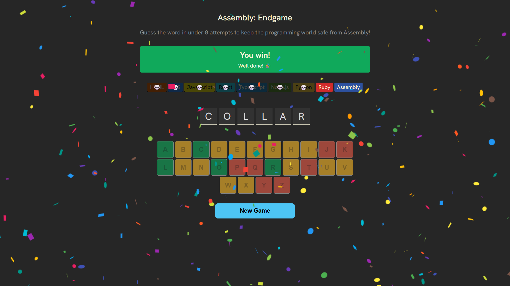

# 🎯 Assembly Endgame

A modern take on the classic Hangman game built with React! Guess the hidden word one letter at a time, with limited chances to survive. Can you guess the word before the game ends?

---

<p align="center">
  <a href="https://akyiishere.github.io/assembly-endgame/" target="_blank">
    
  </a>
</p>

---

## 🚀 Features

- Random word selection
- Interactive letter buttons
- Visual hangman stage updates on wrong guesses
- Win/lose animations and endgame screen
- Responsive layout for mobile & desktop

## 🛠️ Built With

- React
- Vite (for project setup)
- JavaScript
- CSS

## 📸 Demo

 <!-- Optional: Replace with your actual image or remove this section -->

## 🧪 How to Run Locally

```bash
# Clone the repository
git clone https://github.com/your-username/assembly-endgame.git

# Go into the project folder
cd assembly-endgame

# Install dependencies
npm install

# Start the development server
npm run dev
```
